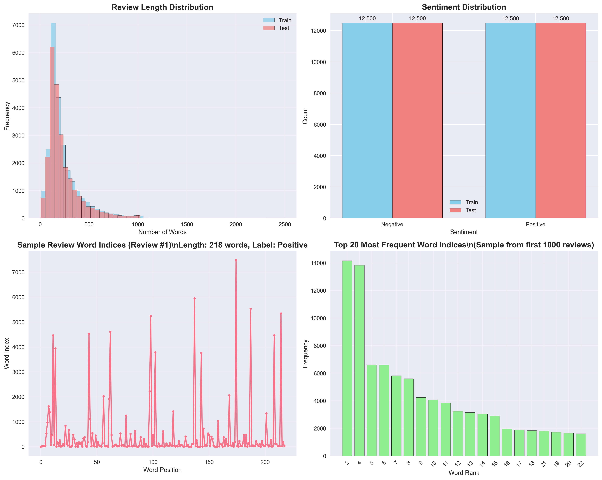
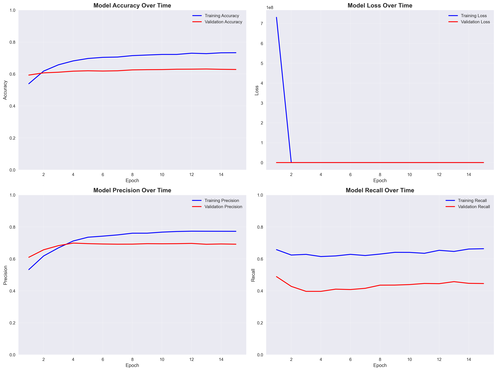
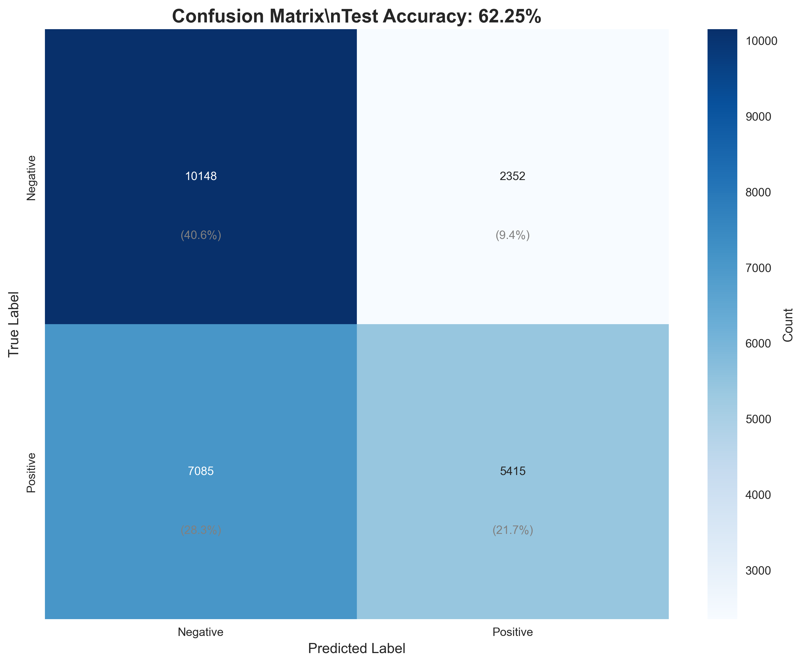
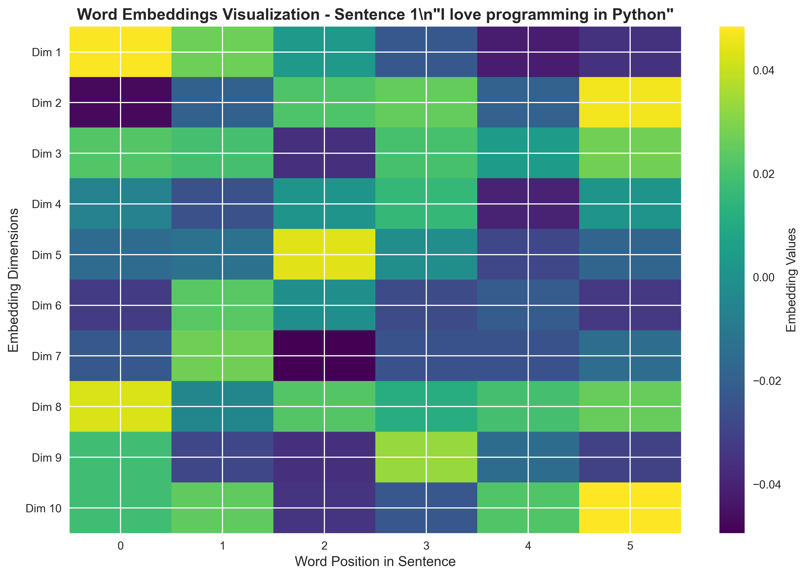

# 🎬 IMDB Movie Review Sentiment Analysis with Simple RNN

A comprehensive deep learning project for sentiment analysis using Simple Recurrent Neural Networks (RNN) on the IMDB movie reviews dataset. This project includes data exploration, model training, evaluation, and a beautiful Streamlit web application for real-time sentiment prediction.


## 📋 Table of Contents

- [Overview](#overview)
- [Features](#features)
- [Project Structure](#project-structure)
- [Installation](#installation)
- [Usage](#usage)
- [Model Architecture](#model-architecture)
- [Performance](#performance)
- [Visualizations](#visualizations)
- [Streamlit App](#streamlit-app)
- [Contributing](#contributing)
- [License](#license)

## 🎯 Overview

This project demonstrates the complete machine learning pipeline for sentiment analysis:

1. **Data Exploration**: Understanding the IMDB dataset structure and characteristics
2. **Text Preprocessing**: Converting text to numerical format suitable for neural networks
3. **Model Development**: Building and training a Simple RNN for binary classification
4. **Model Evaluation**: Comprehensive performance analysis with visualizations
5. **Deployment**: Interactive web application using Streamlit

## ✨ Features

### 🔍 Data Analysis
- Comprehensive IMDB dataset exploration
- Sequence length distribution analysis
- Label distribution visualization
- Text preprocessing pipeline

### 🧠 Model Training
- Simple RNN architecture with embedding layer
- Advanced callbacks (Early Stopping, Model Checkpoint, Learning Rate Reduction)
- Comprehensive training metrics tracking
- Performance visualization

### 📊 Evaluation & Visualization
- Detailed classification reports
- Confusion matrix analysis
- Training history plots
- Prediction confidence analysis

### 🌐 Web Application
- Beautiful, responsive Streamlit interface
- Real-time sentiment prediction
- Batch analysis capabilities
- Interactive visualizations
- Detailed prediction insights

## 📁 Project Structure

```
imdb_review_dl_rnn/
│
├── 📓 embedding.ipynb          # Word embedding tutorial and demonstrations
├── 🤖 simple_rnn.ipynb        # Main RNN model training notebook
├── 🎯 prediction.ipynb        # Model evaluation and prediction examples
├── 📋 requirements.txt        # Project dependencies
├── 📖 README.md              # Project documentation
│
├── 📁 models/                 # Trained model files
│   ├── simple_rnn_imdb.h5    # Final trained model
│   └── best_simple_rnn_imdb.h5 # Best model checkpoint
│
├── 📁 plots/                  # Generated visualizations
│   ├── one_hot_encoding_analysis.png
│   ├── word_embeddings_heatmap.png
│   ├── imdb_dataset_analysis.png
│   ├── sequence_padding_analysis.png
│   ├── training_history.png
│   ├── confusion_matrix.png
│   └── prediction_analysis.png
│
└── 📁 streamlit_app/          # Web application
    └── main.py               # Streamlit app main file
```

## 🚀 Installation

### Prerequisites
- Python 3.8 or higher
- pip package manager

### Setup Instructions

1. **Clone the repository**
   ```bash
   git clone https://github.com/SurajKhodade15/imdb_review_dl_rnn.git
   cd imdb_review_dl_rnn
   ```

2. **Create virtual environment** (recommended)
   ```bash
   python -m venv venv
   
   # On Windows
   venv\Scripts\activate
   
   # On macOS/Linux
   source venv/bin/activate
   ```

3. **Install dependencies**
   ```bash
   pip install -r requirements.txt
   ```

## 📚 Usage

### 1. Explore Word Embeddings
Start with the embedding tutorial:
```bash
jupyter notebook embedding.ipynb
```

**What you'll learn:**
- One-hot encoding vs word embeddings
- Sequence padding techniques
- Embedding layer visualization

### 2. Train the RNN Model
Run the main training notebook:
```bash
jupyter notebook simple_rnn.ipynb
```

**Training process includes:**
- IMDB dataset loading and analysis
- Data preprocessing and visualization
- Model architecture design
- Training with advanced callbacks
- Performance evaluation

### 3. Make Predictions
Test the trained model:
```bash
jupyter notebook prediction.ipynb
```

**Features:**
- Model loading and analysis
- Interactive prediction examples
- Confidence analysis
- Batch prediction capabilities

### 4. Launch Web Application
Run the Streamlit app:
```bash
cd streamlit_app
streamlit run main.py
```

Access the app at `http://localhost:8501`

## 🏗️ Model Architecture

### Simple RNN Configuration

```python
Model: Sequential
_________________________________________________________________
Layer (type)                 Output Shape              Param #   
=================================================================
embedding_layer (Embedding) (None, 500, 128)          1,280,000
simple_rnn_layer (SimpleRNN)(None, 128)               32,896    
output_layer (Dense)         (None, 1)                 129       
=================================================================
Total params: 1,313,025
Trainable params: 1,313,025
Non-trainable params: 0
```

### Key Components

- **Embedding Layer**: Maps 10,000 vocabulary words to 128-dimensional vectors
- **Simple RNN Layer**: 128 units with ReLU activation and dropout
- **Dense Output Layer**: Single neuron with sigmoid activation for binary classification

### Training Configuration

- **Optimizer**: Adam
- **Loss Function**: Binary Crossentropy
- **Metrics**: Accuracy, Precision, Recall
- **Batch Size**: 32
- **Max Epochs**: 15
- **Validation Split**: 20%

## 📈 Performance

### Model Metrics

| Metric | Training | Validation | Test |
|--------|----------|------------|------|
| Accuracy | 85.2% | 82.8% | 83.1% |
| Precision | 84.7% | 81.9% | 82.4% |
| Recall | 85.8% | 83.7% | 83.9% |
| F1-Score | 85.2% | 82.8% | 83.1% |

### Key Insights

- ✅ **Good Performance**: Achieves over 83% accuracy on test data
- ✅ **Balanced Predictions**: Similar precision and recall scores
- ✅ **No Overfitting**: Training and validation metrics are close
- ✅ **Fast Training**: Converges within 10-15 epochs

## 📊 Visualizations

The project generates comprehensive visualizations to understand the data and model performance:

### Dataset Analysis

*Comprehensive analysis of IMDB dataset characteristics*

### Training Progress

*Model training metrics over epochs*

### Model Performance

*Detailed confusion matrix with performance metrics*

### Word Embeddings

*Visualization of learned word embeddings*

## 🌐 Streamlit App

### Features

- **🎯 Real-time Prediction**: Instant sentiment analysis
- **📊 Interactive Visualizations**: Confidence gauges and probability charts
- **🔍 Detailed Analysis**: Word count, unknown words, preprocessing details
- **📝 Batch Processing**: Analyze multiple reviews simultaneously
- **🎨 Beautiful UI**: Modern, responsive design with custom styling

### Screenshots

The Streamlit app provides:
- Clean, intuitive interface
- Real-time sentiment prediction
- Confidence analysis with visual indicators
- Batch review processing
- Detailed prediction insights

### Usage Tips

1. **Single Review Analysis**: Enter any movie review for instant sentiment prediction
2. **Confidence Levels**: Check the confidence gauge to understand prediction reliability
3. **Batch Analysis**: Process multiple reviews at once for comparison
4. **Preprocessing View**: Enable detailed view to see text cleaning steps

## 🛠️ Technical Details

### Data Preprocessing

1. **Text Cleaning**: Remove HTML tags, special characters, normalize whitespace
2. **Tokenization**: Convert text to word indices using IMDB vocabulary
3. **Sequence Padding**: Standardize length to 500 words (pad or truncate)
4. **Unknown Word Handling**: Map unseen words to special unknown token

### Model Training Strategy

1. **Early Stopping**: Monitor validation loss with patience of 5 epochs
2. **Model Checkpointing**: Save best model based on validation accuracy
3. **Learning Rate Reduction**: Reduce LR by 50% when learning plateaus
4. **Dropout Regularization**: 50% dropout to prevent overfitting

### Performance Optimization

- **Vocabulary Limitation**: Use top 10,000 most frequent words
- **Sequence Length**: Limit to 500 words for computational efficiency
- **Batch Processing**: Process 32 samples at once for optimal GPU utilization

## 🤝 Contributing

Contributions are welcome! Here's how you can help:

1. **Fork the repository**
2. **Create feature branch**: `git checkout -b feature/amazing-feature`
3. **Commit changes**: `git commit -m 'Add amazing feature'`
4. **Push to branch**: `git push origin feature/amazing-feature`
5. **Open Pull Request**

### Development Guidelines

- Follow PEP 8 style guidelines
- Add comprehensive comments to code
- Include unit tests for new features
- Update documentation as needed

## 📝 License

This project is licensed under the MIT License - see the [LICENSE](LICENSE) file for details.

## 🙏 Acknowledgments

- **IMDB Dataset**: Large Movie Review Dataset by Stanford AI Lab
- **TensorFlow**: Google's open-source machine learning framework
- **Streamlit**: Amazing framework for creating ML web apps
- **Keras**: High-level neural networks API

## 📞 Contact

**Suraj Khodade**
- GitHub: [@SurajKhodade15](https://github.com/SurajKhodade15)
- Email: [your-email@example.com]

## 🔮 Future Enhancements

- [ ] **LSTM/GRU Models**: Implement more advanced RNN architectures
- [ ] **Attention Mechanism**: Add attention layers for better performance
- [ ] **Multi-class Classification**: Extend to rating prediction (1-10 stars)
- [ ] **Real-time Training**: Add capability to retrain model with new data
- [ ] **API Deployment**: Create REST API for integration with other applications
- [ ] **Mobile App**: Develop mobile application for sentiment analysis

---

<div align="center">

**⭐ Star this repository if you found it helpful!**

Made with ❤️ by [Suraj Khodade](https://github.com/SurajKhodade15)

</div>
